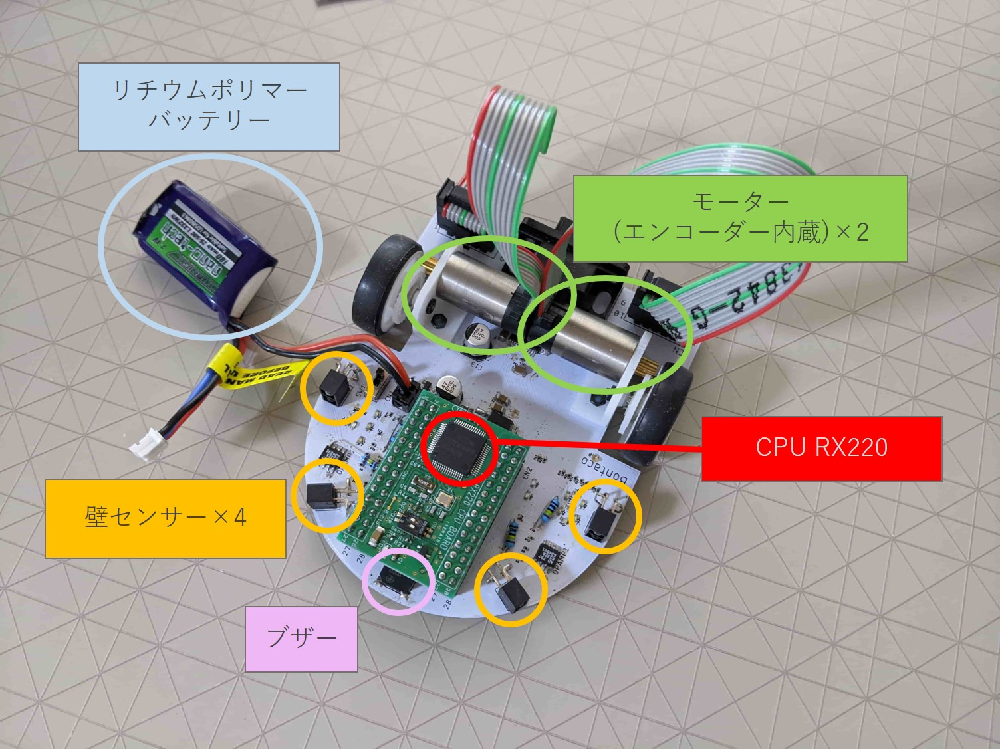

# マイクロマウスBotaco号の機体構成
マイクロマウスの課題を達成するため、Bontaco号の機体は以下のコンポーネントから構成されています。

- CPU
- モーター×2
- ロータリーエンコーダ×2
- 壁センサー×4
- ブザー
- リチウムポリマーバッテリー

このほかにも電源回路などといったさまざまな回路は必要になりますが、
プログラムの観点からは考える必要がないため省略しています。
また、デバッグ用のLEDもありますが見づらいため、デバッグ用部品としてブザーで代表しています。

これはマイクロマウスの機体としてはおそらくほぼ最低限の構成となっており、まあまあオーソドックスな構成だと思います。

マイクロマウスという競技の課題を達成するにあたり、機体には以下の能力が必要となります。

1. 制限時間内に迷路内を探索してゴールを見つけ出すため、決まった距離・角度だけ直進や右左折が可能な運動能力
2. 迷路の壁を検知することのできる検知能力
3. 迷路を探索し、ゴールへのルート（できれば最速ルート）を見つけられる演算能力

CPUとその上で走るプログラムの役割は、迷路を探索して最速でゴールを見つけることです。
そのために、センサーやエンコーダーからの信号を解釈して、2つのモーターをそれぞれどれだけ回転させるか指示を与えます。

各要素がどのような情報をやり取りしているかをざっと示したのが以下の図です。

Bontaco号のプログラムはかなり細かくファイルを分割して作成しています。
ファイルはおよそそれぞれのコンポーネントに対応しており、一つのモジュールを形成しています。
以下のそれぞれのモジュールの機能を記述していきます。

---
## **bontaco_battery_watch**
このモジュールはリチウムポリマー電池のバッテリー電圧を監視しています。
リチウムポリマー電池はデリケートな電池で、充電のし過ぎも放電のし過ぎも良くありません。
過充電は発火や爆発の原因となり、過放電はバッテリーを劣化させて容量を低下させます。
過充電の対策はちゃんとした充電器を使えばよいですが、過放電は使用中にコントロールしなければいけません。

また、モーターには電池から直接電源を供給しているため、電源電圧の変動によってモーターの出力が変動します。
これを考慮しないと充電直後としばらく走ったあとでモーターの特性が変化したようにプログラムからは見えます。

以上のことから電池を監視し、電圧を読み取るのがこのモジュールの役目です。

---
## **bontaco_buzzer**
このモジュールは搭載したブザーを鳴らすためのものです。
デバッグ用にはLEDも搭載していますが、走っている途中にLEDを視認するのは難しいため、動きに関係なく聞こえるブザーは重宝します。

---
## **bontaco_drive**
このモジュールは機体の運動をコントロールするためのモジュールです。
どのような動きをするかが入力として与えられ、その動きを実現するためにモーターの出力を制御します。
目下のところ最優先で開発中です。

---
## **bontaco_encoder**
このモジュールはエンコーダーからの信号を処理し、モーターがどれくらい回転したかを返します。

---
## **bontaco_init**
このモジュールはプログラムの初期化処理をまとめたものです。
どのピンにどの機能を使用するかを指定したり、内部で使用するタイマーの設定をしたりしています。
採用したCPU(RX220)に強く依存した処理となります。

---
## **bontaco_interrupt**
このモジュールは割り込みで実行される関数をまとめたものです。
主にタイマー割り込みで定期的に実行される処理が記述してあります。

---
## **bontaco_led**
このモジュールはデバッグ用のLEDを使用するためのものです。
Bontaco号はデバッグ用のLED3つと7セグメントLEDを一つ搭載しています。
開発中の必要に応じて、LEDを点灯・消灯させる関数を持っています。

---
## **bontaco_motor_pwm**
このモジュールは直接モーターに対してPWM方式で出力を与えます。
bontaco_driveモジュールからこのモジュールを介してモーターを制御します。

---
## **bontaco_photosensor**
このモジュールは壁センサーを制御し、センサーからの値を管理するためのモジュールです。
4つのセンサーのどれを使うかや、センサーの出力電圧をAD変換する手順が記述してあります。

---
## **bontaco_sci**
このモジュールはデバッグのためPCとシリアル通信する関数が記述してあります。

---
## **bontaco_test**
このモジュールは開発のため機能のテストがまとめられています。

---
## **bontaco_timer**
このモジュールは実時間のタイマーを実現するためのものです。
タイマー割り込みで1msごとに実行される関数を利用しています。

---
## **bontaco_util**
このモジュールは便利関数を集めたものです。が、botaco_sciなどと重複しているのでそのうち整理します。
